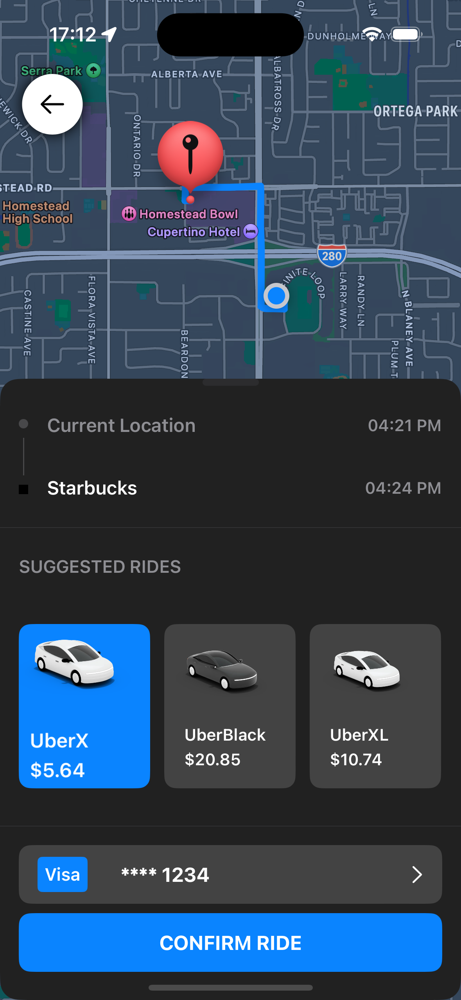
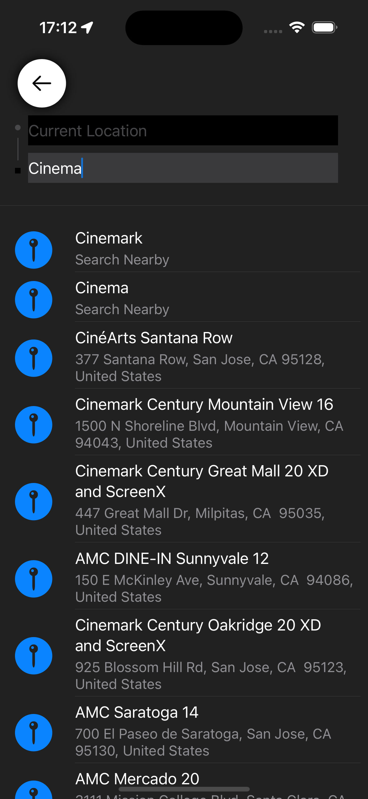

# UberClone

UberClone is a SwiftUI-based iOS application that mimics the functionality of the Uber ride-hailing app. It allows users to select a ride type, view trip information, and confirm a ride. This project demonstrates the use of SwiftUI, data binding, environment objects, and custom view components.

## Features

- **Trip Information View**: Displays the current location, pickup time, selected destination, and drop-off time.
- **Ride Type Selection**: Allows users to choose from different ride types (e.g., UberX, UberXL) with dynamic pricing.
- **Payment Option View**: Shows the selected payment method and card details.
- **Ride Confirmation**: Provides a button to confirm the ride request.

## Screenshots


<div style="display: flex; flex-direction: column; align-items: center;">
  
  
</div>

## Requirements

- iOS 14.0+
- Xcode 12.0+
- Swift 5.3+

## Installation

1. Clone the repository:
   ```bash
   git clone https://github.com/vrmvn09/UberClone.git
   ```

2. Open the project in Xcode:
   ```bash
   cd UberClone
   open UberClone.xcodeproj
   ```

3. Build and run the project on your preferred simulator or device.

## Usage

- Launch the app.
- View the trip information.
- Scroll through the ride types and select one.
- View the dynamically calculated price for the selected ride type.
- Confirm the ride by tapping the "CONFIRM RIDE" button.

## Code Overview

### RideRequestView.swift

This file contains the main view for the ride request screen. It includes subviews for displaying trip information, ride type selection, payment options, and the confirmation button.

### Double+Extensions.swift

This file contains an extension for the `Double` type to format numbers as currency using a custom `NumberFormatter` set to the `en_US` locale to ensure prices are displayed in USD.

### LocationSearchViewModel.swift

This file contains the view model for handling location search and selection. It manages the current location, selected destination, pickup time, and drop-off time.

### RideType.swift

This file defines the `RideType` enum, which includes different types of rides (e.g., UberX, UberXL) and their associated images and descriptions.

## Customization

To customize the app, you can modify the ride types, update the images, or change the styling of the views. Adjust the `RideType` enum and update the assets in the `Assets.xcassets` folder as needed.

## Contributing

Contributions are welcome! If you have any ideas, suggestions, or bug reports, please create an issue or submit a pull request.

## License

This project is licensed under the MIT License. See the [LICENSE](LICENSE) file for details.

## Acknowledgements

- [SwiftUI](https://developer.apple.com/xcode/swiftui/)
- [Xcode](https://developer.apple.com/xcode/)
